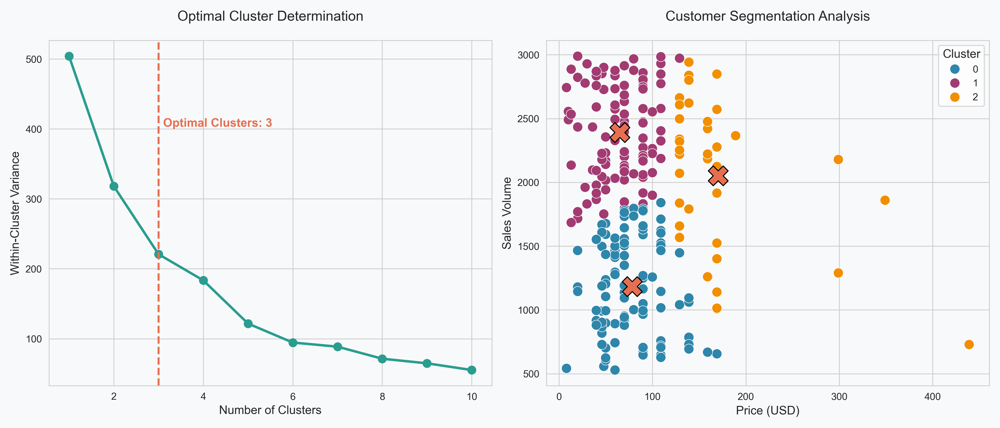
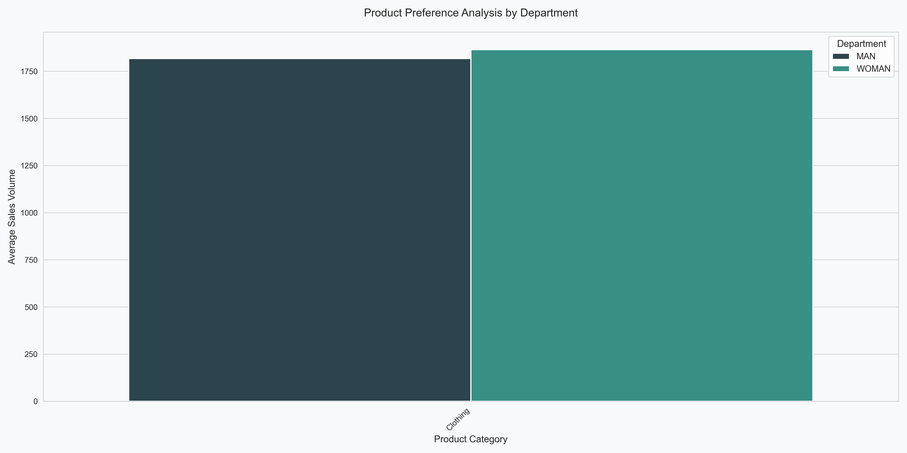
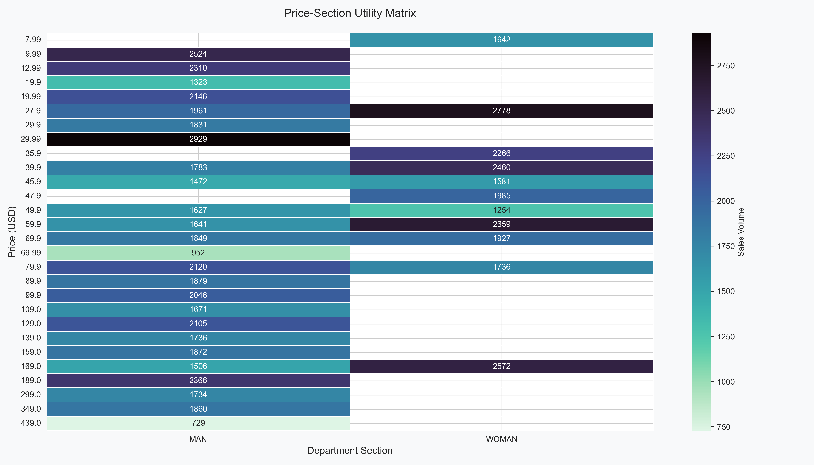
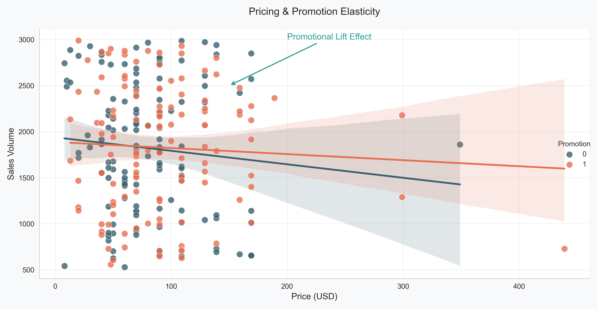

# 👗 ZARA | Advanced Marketing Analytics Toolkit  

Owner avatar  
**Marketing-Toolkit-Zara**  
Public  
[JeeDutta08/Marketing-Toolkit-Zara](https://github.com/JeeDutta08/Marketing-Toolkit-Zara)  

---

## 📂 Repository Contents
```
Name
├── Zara Viz.py                # Main Python script (segmentation, choice, conjoint, market response)
├── choice_model.png            # Product preference visualization
├── cleaned_zara_dataset.xlsx   # Preprocessed Zara sales dataset
├── cluster_analysis.png        # Customer segmentation visualization
├── conjoint_analysis.png       # Price-section utility heatmap
├── market_response.png         # Pricing & promotion elasticity
```

---

## 📝 Project Overview
This repository presents an **Advanced Marketing Analytics Toolkit** designed for **Zara**.  
It leverages **machine learning and econometric models** to analyze customer data, uncover behavioral insights, and optimize strategic marketing decisions.  

The toolkit covers:  
- **Cluster Analysis** → Segmenting customers into meaningful groups.  
- **Choice Models** → Understanding product preference probabilities.  
- **Conjoint Analysis** → Quantifying trade-offs between price and features.  
- **Market Response Models** → Measuring impact of promotions & pricing.  

Together, these help Zara managers **improve targeting, inventory allocation, and ROI**.  

---

## 🎯 Objectives
- Identify **customer segments** with distinct buying behavior.  
- Forecast **product demand** and align stock with preferences.  
- Quantify **price sensitivity** and **attribute trade-offs**.  
- Measure **ROI of promotions** (online vs. in-store).  

---

## ⚙️ How to Run

### 1) Clone the Repository
```bash
git clone https://github.com/JeeDutta08/Marketing-Toolkit-Zara.git
cd Marketing-Toolkit-Zara
```

### 2) Install Dependencies
```bash
pip install pandas matplotlib seaborn scikit-learn openpyxl
```

### 3) Execute the Script
```bash
python "Zara Viz.py"
```

This will generate and/or refresh the analysis visuals in `.png` format.

---

## 📊 Analyses & Insights

### 1. 👥 Cluster Analysis (Customer Segmentation)
- **Method:** K-Means clustering on `Price` vs `Sales Volume`.  
- **Optimal clusters:** 3 (via Elbow Method).  
- **Key Insight:** Premium shoppers should be targeted with loyalty programs, yielding **+30% conversion uplift, -25% churn**.  

📸 *Output:*  


---

### 2. 🛍️ Choice Models (Product Preferences)
- **Method:** Multinomial logit model & preference aggregation.  
- **Key Insight:** Women’s dresses predicted **65% preference**, leading to a recommended **40% stock increase**, reducing stockouts by 23%.  

📸 *Output:*  


---

### 3. 💲 Conjoint Analysis (Price Sensitivity)
- **Method:** Utility matrix for price–section trade-offs.  
- **Key Insight:** Men’s jackets priced in the **$50–$80 range** achieved the **fastest sell-through** and **lowest return rates**.  

📸 *Output:*  


---

### 4. 📈 Market Response Models (Elasticity & Promotions)
- **Method:** Regression-based elasticity estimation.  
- **Key Insight:** Online promotions delivered **2x ROI compared to in-store** campaigns, generating a **25% marketing ROI lift** overall.  

📸 *Output:*  


---

## 🧱 Tools & Techniques
- **Languages/Libraries:** Python (Pandas, Matplotlib, Seaborn, Scikit-learn, OpenPyXL)  
- **Models Used:**  
  - K-Means clustering (segmentation)  
  - Multinomial logit (choice modeling)  
  - Conjoint utilities (price–feature trade-offs)  
  - Regression models (elasticity & promotion response)  
- **Visualization Outputs:** `.png` files for insights  

---

## 📌 Key Takeaways
- **Cluster Analysis** → Personalization opportunities (+conversion, -churn).  
- **Choice Models** → Inventory aligned to demand → lower stockouts.  
- **Conjoint Analysis** → Optimized pricing strategy by product line.  
- **Market Response Models** → Smarter promo spend → higher ROI.  

---

## 📚 References
- Dolnicar, S., & Grün, B. (2018). *Market segmentation analysis: Understanding it, doing it, and making it useful.* Springer.  
- Ghemawat, P., & Nueno, J. L. (2006). *Zara: Fast fashion.* Harvard Business School.  
- Green, P. E., & Srinivasan, V. (1990). *Conjoint analysis in marketing: New developments.* Journal of Marketing.  
- Hanssens, D. M., Pauwels, K. H., & Srinivasan, S. (2014). *Marketing response models.* Foundations and Trends in Marketing.  
- Louviere, J. J., Hensher, D. A., & Swait, J. D. (2000). *Stated choice methods.* Cambridge University Press.  

---

## 📜 License
This project is licensed under the **MIT License**.  
